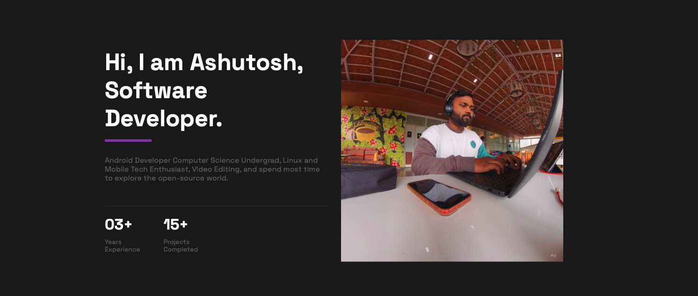

  

<h1 align="center">Hi , I'm Ashutosh Wahane</h1>
<h3 align="center">Software Development Engineer | Android and IOS! | Kotlin Multiplatform </h3>

  <em>
    
   <b>I'm an experienced Android developer with over 3 years of Experience.<b>I've had the privilege to work on a diverse range of projects like EV vehicle app, Gaming Companion app, Smart home app, Blockchain app and Complex consumer facing app
  <b><i> When I'm not coding, I love to stay up-to-date with the latest technology trends and also I love video editing. Apart from computer stuff I like dancing and football !!!</i></b> 

  
<a class="badge-base__link LI-simple-link" href="https://in.linkedin.com/in/ashutoshwahane?trk=profile-badge">Ashutosh Wahane</a>

              
#### :books: Recent Blog Posts
<!-- BLOGPOSTS:START -->
 - 💫 [Wearable Wonders :  Wear OS Introduction](https://blog.ashutoshwahane.dev/wearable-wonders-wear-os-introduction)
 - 💯 [Shielding Your Android App](https://blog.ashutoshwahane.dev/shielding-your-android-app)
 - 💯 [Automate Android Development Workflow with GitHub Actions](https://blog.ashutoshwahane.dev/automate-android-development-workflow-with-github-actions)
 - 🚀 [Simplified Your Android Workflow](https://blog.ashutoshwahane.dev/simplified-your-android-workflow)<!-- BLOGPOSTS:END -->

